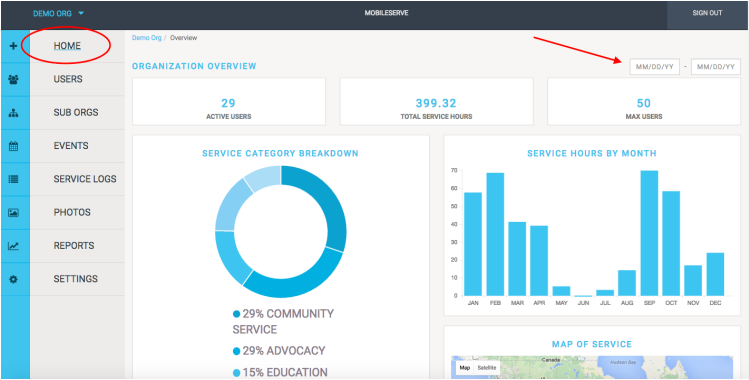

# MobileServe Impact Tracker Administrators Guide
There is also a [Users Guide](user_manual_index.md) for MobileServe users.

## How To Access the Admin Dashboard
- From the main menu of your MobileServe account, select "Dashboard."
- OR, go directly to the dashboard on any internet connected device at:
[https://app.mobileserve.org/dashboard/](https://app.mobileserve.org/dashboard)

## Dashboard Home

### Organization Overview

The Organization Overview is your Dashboard home and provides a quick glance at your
organization. If you have any sub-organizations, they’ll be listed at the bottom of this page.

#### Tips
- Filter the data by date in the top right corner.
- Hover over a Service Category to see total number of hours for that category

## Users

In the Users section, you can invite and manage users. The User Management page shows
basic contact information as well as total service hours each user has contributed to date.

etc, etc, etc...
