# MobileServe Impact Tracker Administrators Guide
There is also a [Users Guide](user_manual_index.md) for MobileServe users.

## How To Access the Admin Dashboard
- From the main menu of your MobileServe account, select "Dashboard."
- **OR**, go directly to the dashboard on any internet connected device at:
[https://app.mobileserve.org/dashboard/](https://app.mobileserve.org/dashboard)

## Dashboard Home

### Organization Overview

The Organization Overview is your Dashboard home and provides a quick glance at your
organization. If you have any sub-organizations, they’ll be listed at the bottom of this page.

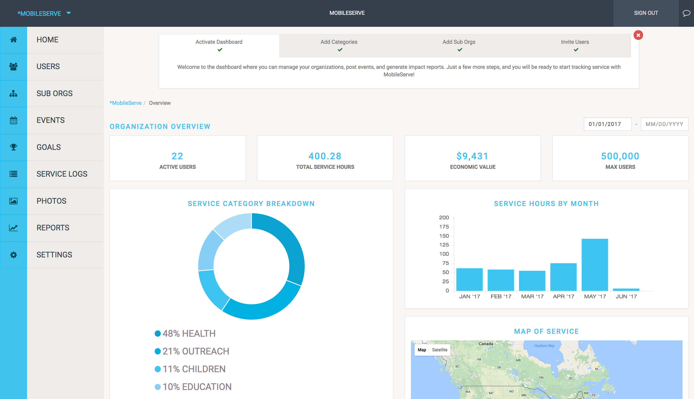

#### Tips
- Filter the data by date in the top right corner.
- Hover over a Service Category to see total number of hours for that category

## Users

In the Users section, you can invite and manage users. The User Management page shows
basic contact information as well as total service hours each user has contributed to date.

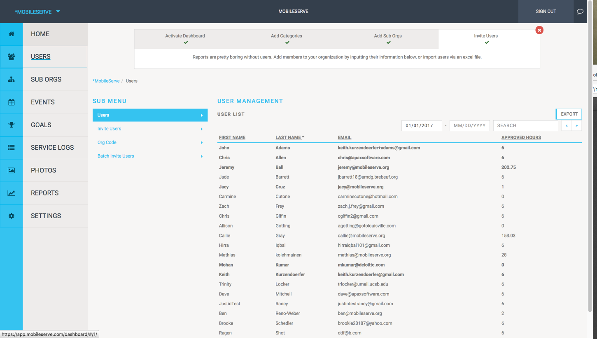

#### Tips
- User Management provides a quick glance at who has or hasn’t logged hours. Sort by
Total Hours by clicking the column title.
- Use the Search box to quickly find a specific user.

## Invite Members

You have 3 options to invite users: enter addresses, upload a list, or email them directly.

### To Invite Users By Entering Email Addresses

This option is best if you don’t have a lot of email addresses or for one-off invites.
- In Users, go to **Invite Users**.
- Enter the user’s contact information. If entering multiple email addresses, separate
with a comma.
- Check the **Admin** box if the new user(s) should be an administrator of the
organization.
- Select **Send Invites**. When the user creates an account through the link in the email,
he or she will automatically be linked to your organization.

### To Invite Users via List Upload

This option is best if you’re inviting several new users.
- Create a list of email addresses in any spreadsheet program. Note: We do not need
names, and the file type doesn’t matter.
  - Indicate if any of the users should be an administrator.
  - If you have sub orgs, indicate which users belong to which sub org.
- Email the list to: [jacy@mobileserve.org](mailto:jacy@mobileserve.org)
- The users will receive an email invitation. When they create an account through the
link in the email, they will automatically be linked to your organization.

### To Invite Users Directly

You can bypass the in-app invitations, and simply provide your org code to your users. This
option is best if you want to personalize the email or if you think people may delete (or not
read) an email that comes directly from MobileServe. They can create MobileServe accounts
and add the code during signup or at any point in their Settings.

### Email Invitation
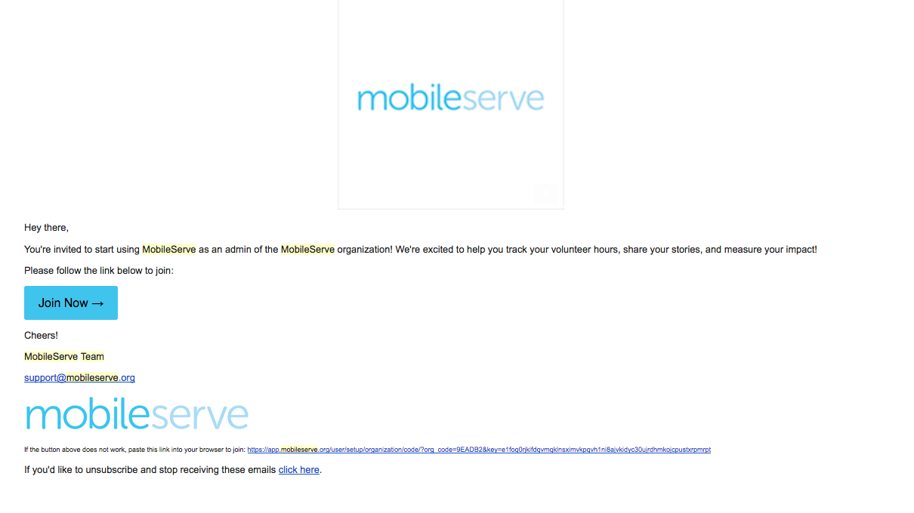

## View Member Details

- From the Users page, select “**View**” next to a user’s name to go to their profile page,
which lists all service logs.
- On the profile page, select “**View**” to see all available details of the specific log.
  - You can Accept or Reject the log on this page, although it’s not required
  
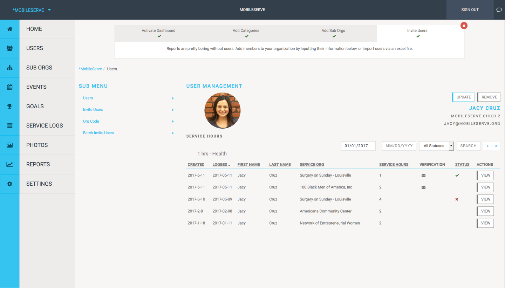

## Sub Orgs

In the Sub Orgs section of your Dashboard, you can create and view sub-organizations. The
default page shows a list of your existing sub orgs and their total hours. Clicking “**Go To**”
next to a name will take you to that sub org’s Dashboard.

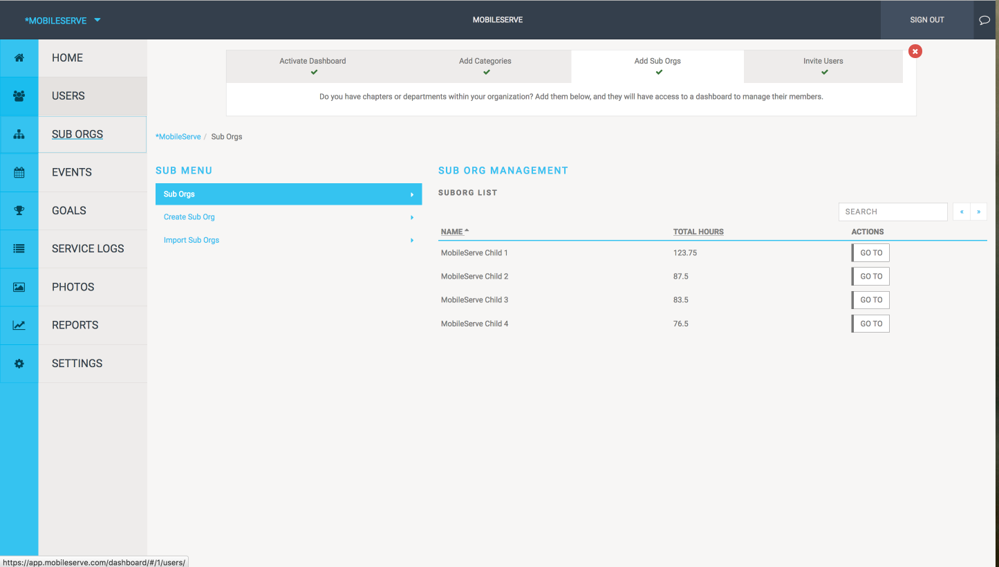

## Create a New Sub Org

- From the Sub Orgs page, select “**Create Sub Org**” and enter the name.
- Once created, the name will appear on the main Sub Org page. You can manage the
sub org (e.g. invite users, view the sub org’s code, etc.) by going to its Dashboard.

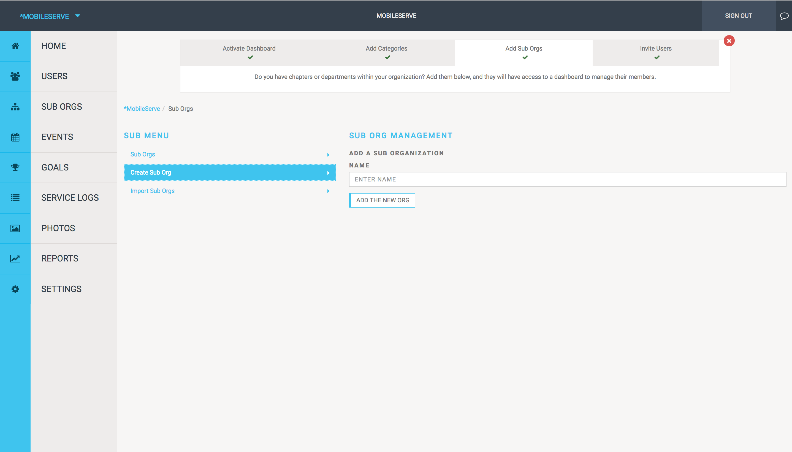

## Events

### Create A Service Opportunity

The Events tab allows your organization and each sub-org to invite users to a service project
or to create multiple service opportunities throughout the year.
From the **Events tab** in the lefthand menu:
- Select “Create Event”
- Enter your event details
- By default it's set up to email the invite to all members in your chapter. If that’s
accurate, select “**Add the New Event**”
- If you'd like to restrict the invite to only some members uncheck the "Everyone is
invited” box.
  - A search box will appear and you can enter names, individual email addresses
and/or suborganization names. The app will provide suggestions as you type.
- When you click "**Add the New Event**" users will receive an email invitation and the
event will automatically be added to their Events section in the app.
- Users have the option to RSVP, but it is not required.

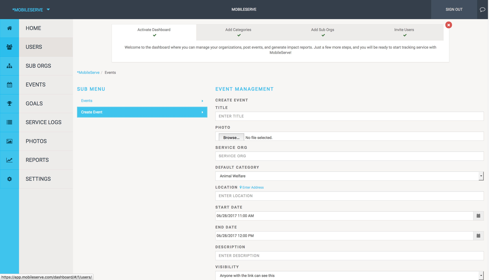

## Event Invite Email
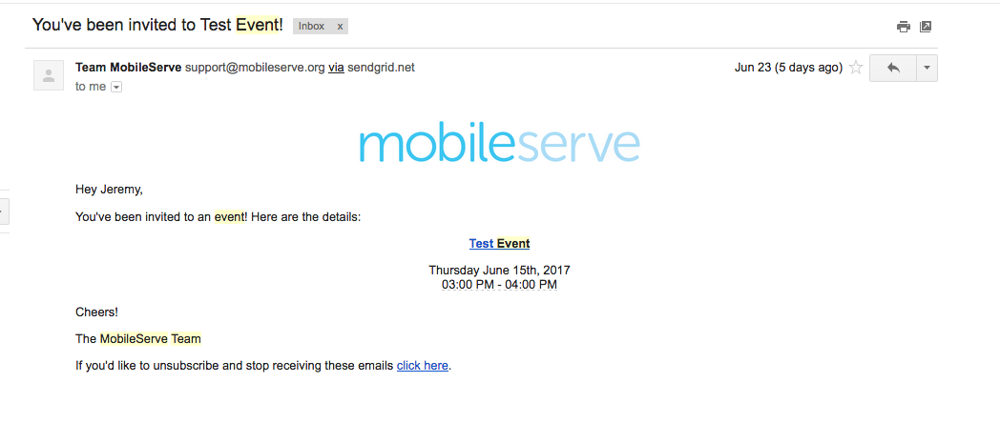

## View or Update an Event

From the **Events** tab:
- Click “View” next to the event you’d like to change or review.
- To make changes, click “Update” on the next page

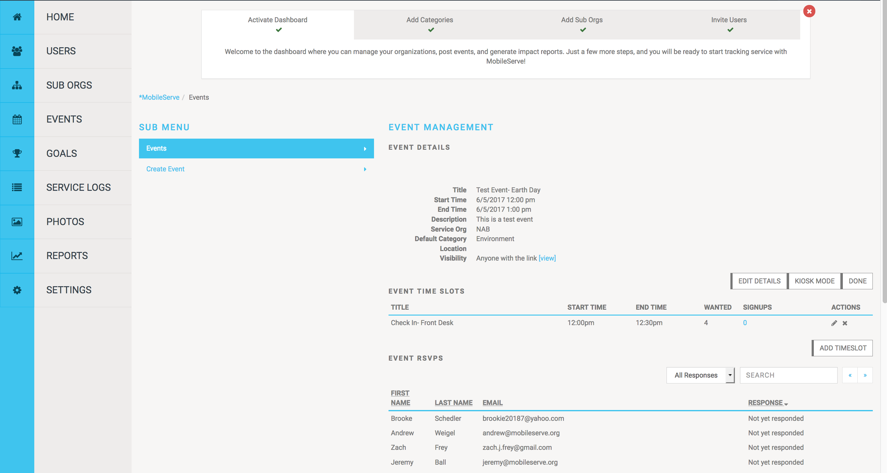

## Service Logs

### View Completed Service Logs
The **Service Logs** section shows every log that has been submitted, whether it was verified
by a supervisor (and how it was verified), and whether you have approved or rejected it.
To see details of a Service Log:
- Click “**View**” next to an individual log

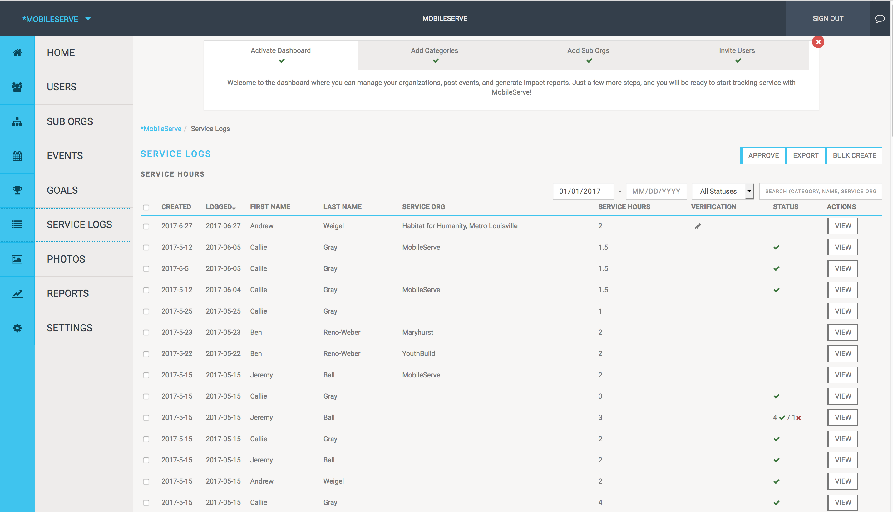
#### Tips
- Filter by date to limit the results.
- Search for a user name or service organization to isolate specific logs.
- Sort by Status to easily see which logs are awaiting your approval.

## Approve or Reject a Service Log

The Service Logs section shows the status of every log. To review the log for approval:
- Click “**View**” next to an individual log.
- Check the box next to the category you’re reviewing (there will only be more than one
category if the user belongs to more than one organization).
- Select the “**Actions**” button.
  - Select “Approve” or “Reject” in the dropdown.
  - If you Approve the log, a check mark will appear in the log.
  - If you Reject the log, a box will appear, giving you the option to explain why
you’re rejecting the log (you are not required to comment).
    - The user will receive an email with a link to the log and the explanation.
    - The user can edit their log and resubmit it for approval again.

## Add Logs on Behalf of Members

Admins can create logs on behalf of an individual, a group, or the entire organization. This
feature is useful when all members participate in a single event or when adding past hours.
From the **Service Logs** page:
- Select “**Bulk Create**”
- Enter log details.
- If you’d like to create the log for all members, check the “**Create for Everyone**” box.
  - Select the “**Bulk Create**” button at the bottom of the page.
- If you want to create the log for one person or only some members, leave the box
unchecked.
  - In the Search box, type in a member’s name and select the correct result. The
user will be added to the box below. You can remove a user by hovering over
clicking the “x” in the top right corner.
  - When you’re finished adding users, select the “**Bulk Create**” button at the
bottom of the page.

## Export Service Logs

Admins can export service log data to a .csv file. The file is emailed to you (it’s sent to the
email address associated with your MobileServe profile).
From the **Service Logs** page:
- To export only some logs, check the box next to those logs.
- Select the “**Export**” button in the top right.
  - Choose “**Selected Logs**” in the dropdown.
- To export all logs, select the “**Export**” button in the top right.
  - Choose “**All Logs**” in the dropdown.

## Photos

Users can include photos when logging their volunteer time, and they have the option to push
them to their social media channels. All photos taken by your members will appear in your
Dashboard in the **Photos** section, regardless of whether the member posted it elsewhere.
Clicking on any photo will take you to the service log it is attached to, so you can easily read
the story behind the image.

## Reports

The **Reports** section of your Dashboard lets you download individual infographics or combine
them for a custom report. All image are downloaded as .png files.

### Download Individual Infographics:

- Under Build Report, click on one of the options.
- Click “**Download Infographic**”
- Click on the option header again to remove it.

### Build a Report

- Under Build Report, click all the data points you want to include.
- The report is built in real-time, so you can see what it looks like to add or remove the
data points.
- Click “**Download Infographic**”

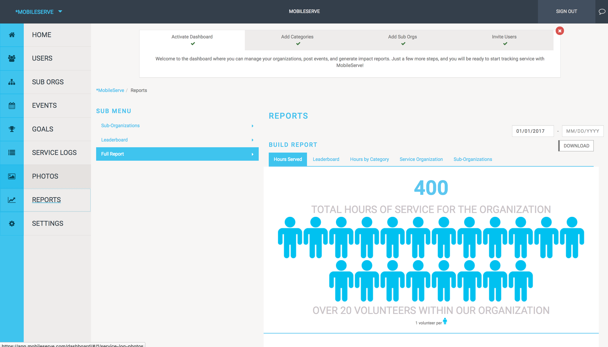

## Settings

Your Settings page shows your Organization name and Service Categories.

## Add / Modify Service Categories

You can add service categories, turn categories on and off, and remove categories.
From the **Settings** page:
- To add a category, type the name into the blank box and hit the “+” incon.
- To change the name of a service category, select the pencil icon next to the name.
  - Enter the new name & hit enter
- To change the visibility of an existing service category, check or uncheck the “Visible”
box.
  - Note: If a category is invisible, users cannot use it in future logs. Any past logs
assigned to that category will continue to show up in that category in your
reports.
- To delete a category, select the trash icon next to the name.
  - If there are hours in that category, you will receive a message asking you to
reassign them to a different category.
  - Note: If you deleted a category, it will not show up in any reports.
